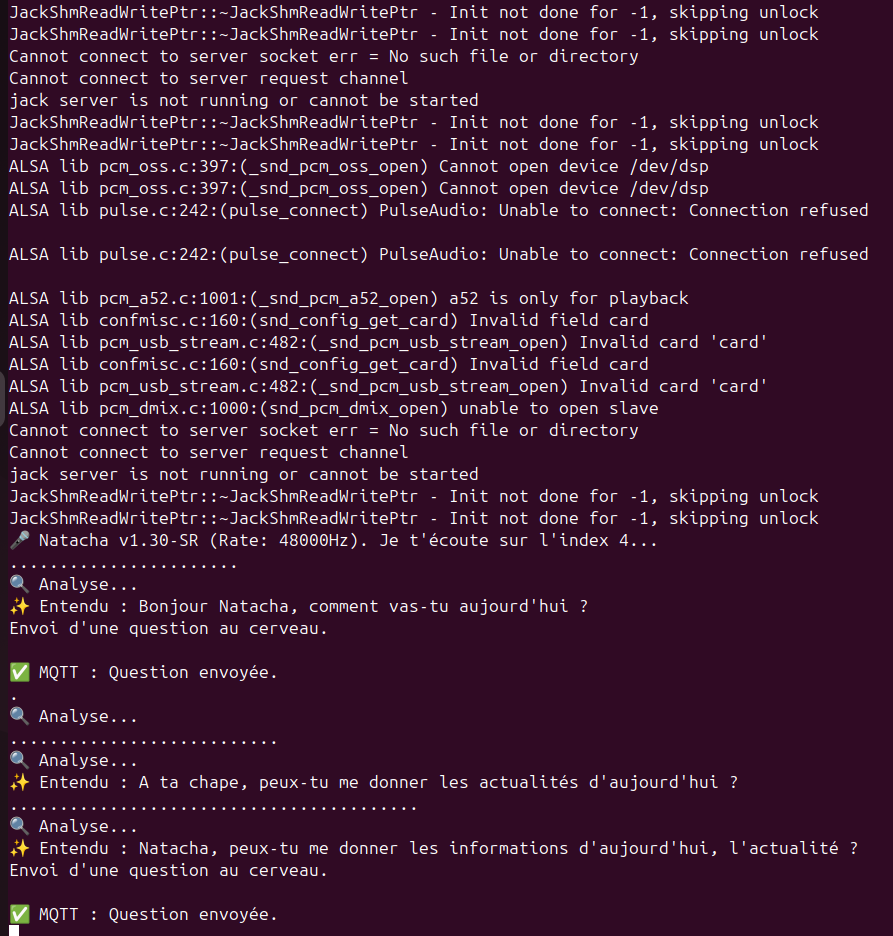
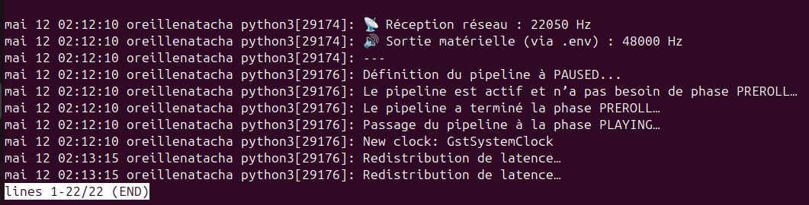

# -Projet-Natacha-Cluster-IA-Distribu-Multi-Backend


Natacha est un assistant personnel modulaire conçu pour fonctionner sur un cluster de machines hétérogènes. Contrairement aux solutions monolithiques, Natacha fragmente l'intelligence (Cerveau, Oreille, Bouche) pour exploiter le meilleur de chaque architecture matérielle (Intel Core, AMD Ryzen, Rockchip SIC).

&nbsp;


​🏗️ Architecture du Système

​Le projet repose sur une communication hybride :

​MQTT : Pour la logique de contrôle et les échanges de texte.

​UDP / GStreamer : Pour le transport audio basse latence entre les nœuds.

​Les Trois Piliers

​L'Oreille (Transcription) : Capture audio et conversion STT (Speech-To-Text).

​Le Cerveau (Inférence) : LLM local pour le raisonnement et la gestion des commandes.

​La Bouche (Synthèse) : TTS (Text-To-Speech) et sortie audio physique.
&nbsp;

​🚀 Compatibilité Matérielle (Multi-Backend)

&nbsp;

# 🛠️ Installation & Déploiement :ear:

📋 Prérequis Système

Le projet Natacha est développé et optimisé pour Ubuntu 24.04 LTS. L'utilisation de cette version garantit
la stabilité des flux audio et la gestion correcte des environnements Conda.

. Système d'exploitation :

    OS : Ubuntu 24.04 LTS (recommandé sur Ryzen et Intel).

    Architecture : x86_64 ou ARM64 (Orange Pi).
    

## 0. Prérequis : Installation de Miniconda3

Si Miniconda n'est pas encore présent sur votre système, vous devez l'installer en premier. La version dépend du type de processeur de votre nœud.

Pour un PC classique (Intel/AMD - ex: i5, Ryzen) :
```
wget https://repo.anaconda.com/miniconda/Miniconda3-latest-Linux-x86_64.sh
./Miniconda3-latest-Linux-x86_64.sh
```

## Pour une carte SBC/Embarquée (ARM - ex: Orange Pi, Raspberry Pi) :
```
wget https://repo.anaconda.com/miniconda/Miniconda3-latest-Linux-aarch64.sh
./Miniconda3-latest-Linux-aarch64.sh
```

Processus d'installation (commun) :

 Appuyez sur Entrée pour faire défiler la licence, puis tapez yes pour l'accepter.
 
 Validez l'emplacement d'installation par défaut en appuyant sur Entrée.
 
 Important : À la fin de l'installation, le script vous demande s'il doit exécuter conda init. Tapez impérativement yes.
 
 Enfin, pour que votre terminal prenne en compte l'installation immédiatement (sans avoir à vous déconnecter), tapez :

```
source ~/.bashrc
```

## 1. Création de l'environnement Conda
Ouvrez un terminal et créez un environnement dédié au nœud (ici, l'Oreille) avec une version de 

Python stable pour l'IA (Python 3.10 ou 3.11 est recommandé) :


```
conda create -n natacha_oreille python=3.11 -y
```


## 2. Activation et Installation


Activez ce nouvel environnement. Votre terminal affichera (natacha_oreille) au début de la ligne :

```
conda activate natacha_oreille
```

Placez-vous dans le dossier du module :

```
cd ~/Natacha-Project/modules/ear
```

L'astuce Conda pour l'audio : Plutôt que d'installer les dépendances système complexes via apt, laissez Conda gérer la compilation de PyAudio et de portaudio proprement :

```
conda install -c conda-forge pyaudio screen -y
```

Puis, installez le reste de vos librairies (MQTT, Faster-Whisper, etc.) :

```
pip install -r requirements.txt
```

## 3. Calibrage Matériel Audio (Uniquement Oreille)

Branchez votre casque/micro, assurez-vous d'être dans l'environnement Conda, et lancez l'utilitaire :

```
python3 setup_audio.py
```
Suivez les instructions pour générer automatiquement votre fichier .env contenant les identifiants de vos périphériques matériels.

Voici un exemple avec mon micro casque USB qui se nomme   "USB DONGLE : Audio"


## 4. Sécurité & Secrets

Pour des raisons de sécurité, les identifiants SSH ne sont pas inclus dans le dépôt. Pour configurer vos accès :

1. Allez dans le dossier `modules/ear/`.

2. Copiez le fichier d'exemple :

   ```bash
   cp secrets_natacha.py.example secrets_natacha.py
   ```

3. Modifiez `secrets_natacha.py` avec vos propres identifiants SSH et adresses IP.

## 5. Exécution & Automatisation (systemd avec Conda)


Vous pouvez tester le script manuellement :

```
python3 oreille_v1_30.py
```

Pour le lancement automatique au démarrage :
Avec Conda, le chemin vers l'exécutable Python est différent. Éditez votre fichier de service (ex: sudo nano /etc/systemd/system/natacha_oreille.service) :


## 6. Automatisation Robuste (Systemd + Screen)

Pour que le nœud démarre tout seul avec la machine tout en restant consultable, nous utilisons un service système couplé à screen.

Créez le fichier de service :

```
sudo nano /etc/systemd/system/oreille_natacha.service
```

Collez la configuration suivante (adaptez vieil par votre nom d'utilisateur) :
Ini, TOML

```
After=network.target pulseaudio.service

[Service]
# On utilise l'utilisateur pour l'accès aux droits audio
User=vieil
Group=vieil

# Dossier où se trouve ton script et ton .env
WorkingDirectory=/home/vieil/Natacha-Project/modules/ear

# Environnement nécessaire pour Ubuntu 24.04 et PulseAudio
Environment="XDG_RUNTIME_DIR=/run/user/1000"
Environment=PYTHONUNBUFFERED=1

# Exécution directe sans screen
ExecStart=/home/vieil/miniconda3/envs/natacha_oreille/bin/python3 bouche_receveur_final_v1_0.py

# Redémarrage automatique en cas de souci
Restart=always
RestartSec=5

[Install]
WantedBy=default.target
```
CTRL + o puis 'entrée' pour sauver le fichier, puis CTRL + x pour sortir de nano

Activez et lancez le service :

```
sudo systemctl enable oreille_natacha.service
sudo systemctl start oreille_natacha.service
```

## 7. Monitoring au quotidien

Grâce à screen, le nœud tourne en tâche de fond mais reste accessible à tout moment :

```
screen -r oreille_natacha
```




Quitter l'affichage sans couper l'IA : Appuyez sur Ctrl+A puis D (Détacher).


## 8. Gstream  écoute de la synthèse vocale au casque 

On utilise le micro casque USB sur la carte ou ordinateur RYZEN 5 "oreille".
La carte reçoit un flux audio provenant de l'orangepi6plus la "Bouche".
Le casque USB va restituer la synthèse vocale provenant de la "Bouche"


Création du service gstream_natacha.service
```
sudo nano /etc/systemd/system/gstream_natacha.service
```

Ajouter le code suivant :
```
[Unit]
Description=GStreamer Receiver pour Natacha (Bouche)
After=network.target

[Service]
Type=simple
User=vieil
Group=vieil
WorkingDirectory=/home/vieil/Natacha-Project/modules/ear
Environment=XDG_RUNTIME_DIR=/run/user/1000
ExecStart=/usr/bin/python3 /home/vieil/Natacha-Project/modules/ear/bouche_receveur_final_v1_0.py
Restart=always
RestartSec=5

[Install]
WantedBy=default.target
```
CTRL + o puis 'entrée' pour sauver le fichier, puis CTRL + x pour sortir de nano

Modifier le nom de l'utilisateur vieil par le votre.


Activez et lancez le service :

```
sudo systemctl enable gstream_natacha.service
sudo systemctl start gstream_natacha.service
```

On peut visualiser le status du service en tapant :

```
systemctl status gstream-natacha
```





</br>

⚙️ Optimisation du flux Audio (UDP)

Le pipeline GStreamer utilise un buffer de sécurité de 512 Ko (buffer-size=524288) pour éviter les craquements audio
sur le réseau Ethernet. Pour que ce buffer soit accepté par le système, vous devez augmenter la limite du noyau Linux :

Éditer la configuration système :

```
sudo nano /etc/sysctl.conf
```
Ajouter les lignes suivantes en bas du fichier :
Plaintext
```
net.core.rmem_max=524288
net.core.wmem_max=524288
```
    
Appliquer les changements :
```
sudo sysctl -p
```
    
Sans cette modification, GStreamer risque d'afficher un avertissement W: [pulsesink] pulseaudio.c: Protocol error ou des pertes de paquets UDP.
Avec ce réglage, le pipeline est "confortable" et peut gérer les 200ms de pré-chargement (min-threshold-time=200000000) sans que le noyau ne sature.

&nbsp;

🎙️ Transcription Haute Fidélité : Faster-Whisper (Medium)   STT

Le module Oreille de Natacha s'appuie sur la technologie Faster-Whisper, une implémentation optimisée du modèle Whisper d'OpenAI utilisant
le moteur CTranslate2. Ce choix technique est au cœur de la réactivité du système.
</br>
</br>
> [!NOTE] Dans le cas ou vous n'avez aucun son au casque, essayer le script modules/ear/reset_audio_natacha.sh
&nbsp;
```
chmod +x reset_audio_natacha.sh 
./reset_audio_natacha.sh
```
</br>

# 🧠 Le Cerveau (Nœud Central : Core i5)


Le Cerveau est le centre de réflexion du cluster. Il héberge le moteur d'inférence LLM et traite les requêtes textuelles pour générer des réponses cohérentes.


ℹ️ Spécifications Techniques

    Processeur : Intel Core i5 (14ème Génération) - 12 Threads.

    Modèle : openhermes-2.5-mistral-7b.Q4_K_M.gguf.

    Moteur : llama.cpp en mode serveur HTTP.

⚙️ Optimisations Performance

    [!TIP]
    Pour maximiser la vitesse d'inférence sur cette architecture, nous utilisons :

        --flash-attn : Accélération de l'attention (Flash Attention).

        --mlock : Verrouillage du modèle en RAM pour éviter la pagination sur le disque.

        --threads 12 : Exploitation totale des capacités du Core i5.

🛠️ Installation de llama.cpp

```
# 1. Récupération des sources
git clone https://github.com/ggerganov/llama.cpp
cd llama.cpp

# 2. Compilation optimisée (via CMake)
mkdir build
cd build
cmake ..
cmake --build . --config Release
```
</br>

📥 Gestion du Modèle (OpenHermes 2.5)

Le modèle utilisé est un fichier au format GGUF, optimisé pour tourner sur CPU.
```
mkdir ~/modeles_natacha
cd ~/modeles_natacha
wget https://huggingface.co/TheBloke/OpenHermes-2.5-Mistral-7B-GGUF/resolve/main/openhermes-2.5-mistral-7b.Q4_K_M.gguf
```

[!NOTE]
Le fichier de service llama-brain.service pointe directement vers ce chemin (/home/vieil/modeles_natacha/).

Création du fichier de service natacha-brain.service
```
sudo nano /etc/systemd/system/natacha-brain.service
```
&nbsp;
</br>
Code du service 
```
[Unit]
Description=Cerveau de Natacha - Serveur Llama.cpp
After=network.target

[Service]
User=vieil
Group=vieil
LimitMEMLOCK=infinity
WorkingDirectory=/home/vieil/llama.cpp

ExecStart=/home/vieil/llama.cpp/build/bin/llama-server \
    -m /home/vieil/modeles_natacha/openhermes-2.5-mistral-7b.Q4_K_M.gguf \
    --ctx-size 2048 \
    --threads 12 \
    --flash-attn on  \
    --mlock \
    --host 127.0.0.1 \
    --port 8000

Restart=always
RestartSec=10

# On laisse un peu plus de marge pour éviter que le service ne soit tué
MemoryMax=16G
# On enlève MemoryHigh ou on le met à 12G pour ne pas brider le mlock
MemoryHigh=15G

[Install]
WantedBy=multi-user.target
```

</br>
📜 Automatisation avec Systemd

Le serveur d'intelligence démarre automatiquement avec le système. Le fichier de service se trouve dans scripts_systemd/brain/llama-brain.service.

Commandes de gestion :

```
sudo systemctl start llama-brain
sudo systemctl status llama-brain
```
</br>

🐍 Environnement & Services du Cerveau

Pour isoler les dépendances et assurer la communication entre les modules, suivez ces étapes d'installation.

1. Gestionnaire d'environnement (Miniconda)

L'utilisation de Miniconda permet de gérer proprement les versions de Python et les bibliothèques sans polluer le système.
Bash

# Création de l'environnement dédié
```
conda create -n cerveau_natacha python=3.11 -y
conda activate cerveau_natacha
```

2. Services de Communication & Savoir (Mosquitto & Kiwix)

Le Cerveau utilise Mosquitto comme chef d'orchestre des messages et Kiwix pour l'accès à la connaissance hors-ligne.
Bash

# Installation du serveur et des clients MQTT
```
sudo apt update && sudo apt install mosquitto mosquitto-clients -y
sudo apt install kiwix-tools -y
```

3. Dépendances Python du module

Une fois l'environnement activé, installez toutes les bibliothèques nécessaires au fonctionnement de l'intelligence :
```
pip install -r /home/vieil/Natacha-Project/modules/brain/requirements.txt
```

# 🧠 Le Cerveau (Nœud Cognitif : Core i5-14500)

Ce module est le centre de réflexion. Il traite les questions reçues par l'oreille,
&nbsp;

consulte ses mémoires et génère une réponse streamée vers la bouche.

&nbsp;

&nbsp;
ℹ️ Fonctionnalités Clés

&nbsp;

&nbsp;
Mémoire Relationnelle : Utilise ChromaDB pour stocker et retrouver les souvenirs personnels de Thierry.
&nbsp;

&nbsp;
Voyage Temporel : Un système de filtrage par année pour les actualités (pratique pour contextualiser les infos).
&nbsp;

&nbsp;
Savoir Déterministe : Interrogation d'un serveur Kiwix local (Wikipedia/ZIM) pour les sujets techniques et physiques.
&nbsp;

&nbsp;
Streaming Intelligent : Découpe la réponse en phrases pour que la "Bouche" commence à parler avant même que la réflexion soit terminée.

&nbsp;

⚙️ Spécifications du SystèmeCPU : Intel Core i5-14500 (14ème Génération) exploitant 12 threads pour l'inférence.

Modèle LLM : OpenHermes 2.5 Mistral 7B (GGUF Q4_K_M).

Base Vectorielle : ChromaDB (Persistent Client).

🛠️ Installation du Module Cerveau

1. Prérequis Système

```
sudo apt install kiwix-tools -y
sudo apt install mosquitto mosquitto-clients -y
```

2. Environnement Python

Il est fortement recommandé d'utiliser l'environnement cerveau_natacha via Miniconda3.
```
conda activate cerveau_natacha
pip install chromadb paho-mqtt beautifulsoup4 requests python-dotenv
```

</br>
 3. Initialisation de la Mémoire (ChromaDB)

&nbsp;

Au premier lancement, le script crée automatiquement le dossier ./memoire_chroma pour stocker les souvenirs et l'expertise.

&nbsp;

4. Création du fichier service  cerveau_natacha.service
```
sudo nano /etc/systemd/system/cerveau_natacha.service
```
5. Ajoute le code suivant (adapte le nom de l'utilisateur) :
```
[Unit]
Description=Cerveau de Natacha - Pont Intelligence (MQTT/ChromaDB/Kiwix)
# On attend que le réseau, le broker MQTT ET le serveur llama.cpp soient prêts
After=network-online.target mosquitto.service llama-brain.service
Requires=mosquitto.service llama-brain.service

[Service]
Type=simple
User=vieil
Group=vieil
# On pointe vers le dossier du projet GitHub
WorkingDirectory=/home/vieil/Natacha-Project/modules/brain

ExecStart=/home/vieil/miniconda3/envs/cerveau_natacha/bin/python3 brain_v33_12.py

# Pour voir les logs en temps réel avec journalctl -u cerveau_natacha -f
Environment=PYTHONUNBUFFERED=1

Restart=always
RestartSec=10

[Install]
WantedBy=multi-user.target
```
6. Activation du service
```
sudo systemctl daemon-reload
sudo systemctl enable cerveau_natacha.service
sudo systemctl start cerveau_natacha.service
```


&nbsp;

📡 Topologies des Flux (MQTT)

&nbsp;
Le cerveau s'abonne et publie sur les canaux suivants :
&nbsp;

    . natacha/question 📥 Réception du texte de l'Oreille

    . natacha/reponse 📤 Envoi de la réponse (phrase par phrase) vers la Bouche.

    . natacha/apprendre 💾 Mémorisation d'une nouvelle connaissance.

    . natacha/raz_memoire 🚨 Réinitialisation complète de ChromaDB.

</br>


Natacha a désormais une structure de déploiement digne des meilleurs serveurs de production.

Ton cluster est paré pour durer dans le temps ! 🚀

&nbsp;

​Le projet  utilise  les accélérateurs matériels disponibles dans mon cas :

| Hardware | Backend Accelerators | Utilisation Optimale |
| :--- | :--- | :--- |
| **Intel Core** | Core I5 14400 32Go RAM| Cerveau (Ultra-rapide) |
| **AMD Ryzen** | Ryzen 5 5500u (AVX-512) / ROCm 32 Go RAM| Oreille (Faster-Whisper) |
| **Rockchip (OPi 6+)** | CIX CD8180/CD8160 SoC 32 Go RAM| Bouche TTS / Audio -Transfert UDP |

&nbsp;

## 📡 Communication Inter-Machines

Natacha utilise une segmentation réseau pour garantir la stabilité :

* **Plan de Données (Ethernet)** : Flux audio et MQTT (Stabilité maximale).

* **Plan de Contrôle (Wi-Fi)** : Mises à jour et accès internet.

* **mDNS/Avahi** : Les machines se reconnaissent automatiquement (ex: `cerveaunatacha.local`).

&nbsp;

## 📝 Roadmap

* [ ] Support complet des NPU Intel via OpenVINO.
* [ ] Intégration des modèles de vision pour l'Orange Pi 6+.
* [ ] Interface de monitoring temps réel du cluster.


## 💡 Pourquoi ce projet ?

Le projet Natacha démontre qu'il est possible de créer une IA domestique puissante en recyclant et en synchronisant du matériel varié, sans dépendre du Cloud, tout en conservant une latence de réponse "humaine".

*Développé par Thierry VIEIL - 2026*


